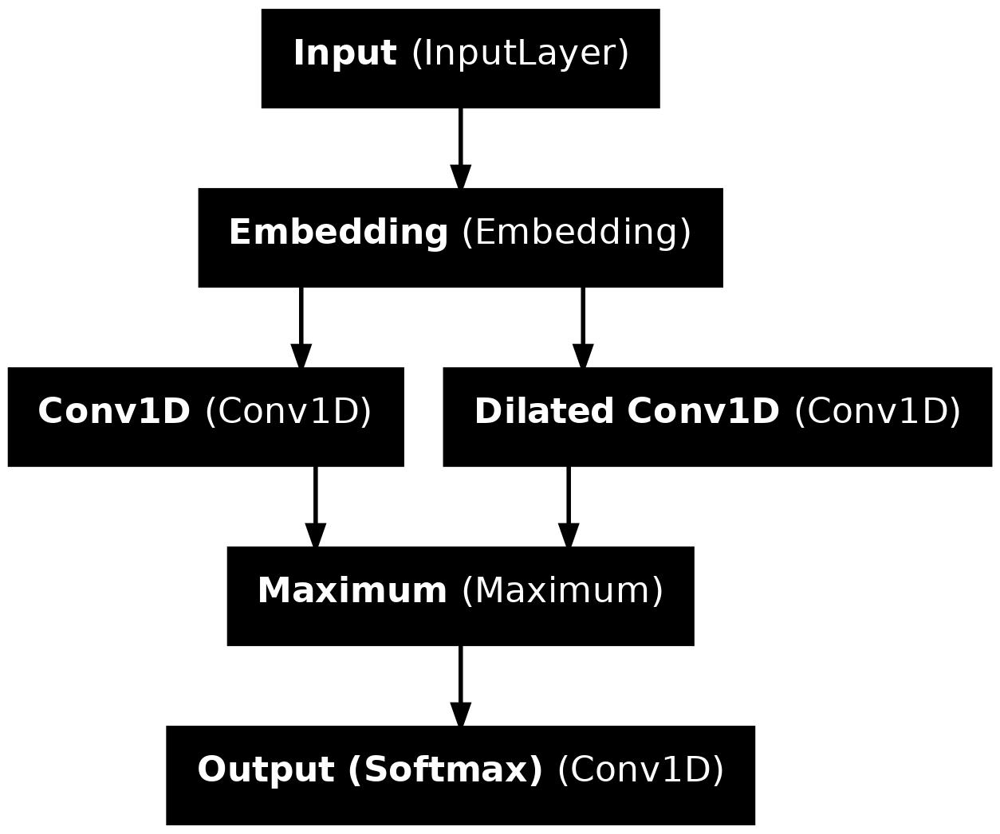

## Convolutional Neural Networks

Author: Shenghong Liu (uni.liushenghong@gmail.com)

The existing LSTM-based segmenter has a linear O(n) time complexity which is not ideal for content-heavy platforms. Hence, I introduce a new model architecture for faster word segmentation of Southeast Asian languages like Thai and Burmese.



The convolutional neural network (CNN) architecture developed in this project achieved faster inference speeds with comparable accuracy for Thai. Not only was the linear time complexity issue resolved, the usage of dilated convolutions also helped maintain a high level of accuracy by capturing a wider context of the surrounding words.

| Model | F1-Score | Model Size | CPU Inference Speed |
|----------|:--------:|:---------:|---------:|
| LSTM Medium  | 90.1  | 36 KB  | 9.29 ms |
| LSTM Small  | 86.7  | 12 KB  | 6.68 ms |
| CNN Medium | 90.4 | 28 KB | 3.76 ms |
| ICU | 86.4 | 126 KB | ~0.2 ms|

### Examples

**Test Case 1**
| Algorithm | Output |
|----------|:---------|
| Unsegmented | พระราชประสงค์ของพระบาทสมเสด็จพระเจ้าอยู่หัวในรัชกาลปัจจุบันคือ |
| Manually Segmented | พระราชประสงค์_ของ_พระบาทสมเสด็จพระเจ้าอยู่หัว_ใน_รัชกาล_ปัจจุบัน_คือ |
| CNN | พระราชประสงค์_ของ_พระบาทสมเสด็จพระเจ้าอยู่หัว_ใน_รัชกาล_ปัจจุบัน_คือ |
| ICU | พระ_ราช_ประสงค์_ของ_พระบาท_สม_เสด็จ_พระเจ้าอยู่หัว_ใน_รัชกาล_ปัจจุบัน_คือ |
| LSTM | พระราชประสงค์_ของ_พระบาทสมเสด็จ_พระเจ้าอยู่หัว_ใน_รัชกาล_ปัจจุบัน_คือ |

**Test Case 2**
| Algorithm | Output |
|----------|:---------|
| Unsegmented | ในขณะเดียวกันผู้ที่ต้องการเงินเพื่อนำไปลงทุนหรือประกอบกิจการอื่นใด |
| Manually Segmented | ใน_ขณะ_เดียว_กัน_ผู้_ที่_ต้องการ_เงิน_เพื่อ_นำ_ไป_ลง_ทุน	_หรือ_ประกอบ_กิจการ_อื่น_ใด |
| CNN | ใน_ขณะ_เดียว_กัน_ผู้_ที่_ต้องการ_เงิน_เพื่อ_นำ_ไป_ลง_ทุน	_หรือ_ประกอบ_กิจการ_อื่น_ใด |
| ICU | ใน_ขณะ_เดียวกัน_ผู้_ที่_ต้องการ_เงิน_เพื่อน_ำ_ไป_ลงทุน_หรือ_ประกอบ_กิจการ_อื่น_ใด |
| LSTM | ใน_ขณะ_เดียว_กัน_ผู้_ที่_ต้อง_การ_เงิน_เพื่อ_นำ_ไป_ลง_ทุน	_หรือ_ประกอบ_กิจการ_อื่น_ใด |

**Test Case 3**

| Algorithm | Output |
|----------|:---------|
| Unsegmented | เพราะเพียงกรดนิวคลีอิคของไวรัสอย่างเดียวก็สร้างไวรัสสมบูรณ์ |
| Manually Segmented | เพราะ_เพียง_กรด_นิวคลีอิค_ของ_ไวรัส_อย่าง_เดียว_ก็_สร้าง_ไวรัส_สมบูรณ์ |
| CNN | เพราะ_เพียง_กรด_นิว_คลี_อิค_ของ_ไวรัส_อย่าง_เดียว_ก็_สร้าง_ไวรัส_สมบูรณ์ |
| ICU | เพราะ_เพียง_กรด_นิ_วค_ลี_อิค_ของ_ไวรัส_อย่าง_เดียว_ก็_สร้าง_ไวรัส_สมบูรณ์ |
| LSTM | เพราะ_เพียง_กรดนิว_คลีอิค_ของ_ไวรัสอย่าง_เดียว_ก็_สร้าง_ไวรัสสมบูรณ์ |

### Hyperparameters

In Vertex AI Custom Training, you need to specify the following hyperparameters:

```
--path=gs://bucket_name/Data/
--language=Thai
--input-type=BEST
--model-type=cnn
--epochs=200
--filters=32
--name=Thai_codepoints_32
--edim=40
--embedding=codepoints
```

* **name:** This is the model name.
* **path:** This is the Google Cloud Storage Bucket link.
* **language:** This is the language that you'll like to train, such as ```Thai``` or ```Burmese```.
* **input-type:** This is the dataset type, such as ```BEST``` for Thai and ```my``` for Burmese. Refer to [Cloud Usage](Cloud%20Usage.md) for more details.
* **model-type:** This is the model architecture type, such as ```lstm``` or ```cnn```.
* **epochs:** This is the number of epochs used to train the model, it is recommended to use a number of >= 200 as the model only trains on 10% of the dataset in each epoch. The model will output the epoch that gives the best validation loss.
* **filters:** This is the number of filters in each Conv1D layer and plays a significant role in data size, accuracy, and inference speed.
* **edim:** This is embedding_dim, the length of each embedding vector and plays a significant role in data size, accuracy, and inference speed.
* **embedding:**: This determines what type of embedding is used to train the model, and can be one of the followings:
  * `"grapheme_clusters_tf"`: This option should be used when one uses grapheme clusters as the embedding unit.
  * `"codepoints"`: this option should be used when the embedding is based on code points.
* **learning-rate:** This determines the model's learning rate. The default is 0.001.


### Model Performance Comparison
**Codepoints**
| Filter Size | Accuracy | F1 Score | Model Size |
|----------|:---------:|:---------:|----------:|
| 8 | 93.1 | 84.8 | 13 KB |
| 16 | 94.5 | 87.7 | 16 KB |
| 32 | 95.7 | 90.4 | 28 KB |
| 64 | 96.6 | 92.5 | 52 KB |
| 128 | 97.3 | 94.0 | 95 KB |

**Grapheme Clusters**
| Filter Size | Accuracy | F1 Score | Model Size |
|----------|:---------:|:---------:|----------:|
| 8 | 94.1 | 89.3 | 13 KB |
| 16 | 95.2 | 91.2 | 14 KB |
| 32 | 95.9 | 92.6 | 24 KB |
| 64 | 96.6 | 93.7 | 34 KB |
| 128 | 97.1 | 94.7 | 55 KB |

[Embeddings Discussions](Embeddings%20Discussion.md) gives detailed comparisons between the embedding types. 