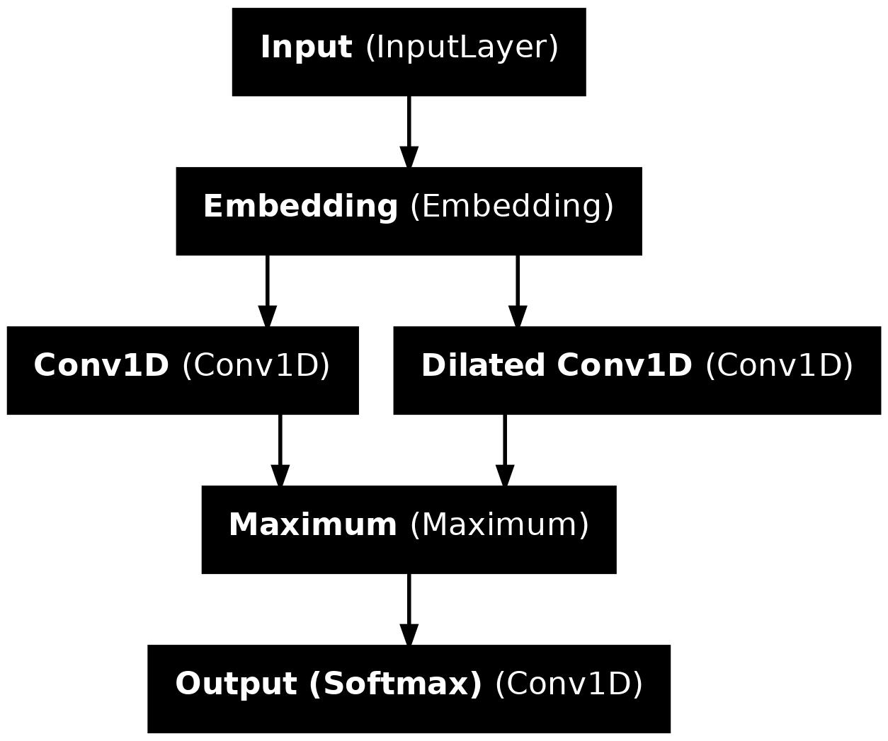

## Convolutional Neural Networks

ရေးသားသူ: Shenghong Liu (uni.liushenghong@gmail.com)

ရှိပြီးသား LSTM-based segmenter သည် linear O(n) time complexity ရှိပြီး content-heavy platform များအတွက် မသင့်တော်ပါ။ ထို့ကြောင့်၊ ထိုင်းနှင့် မြန်မာကဲ့သို့သော အရှေ့တောင်အာရှ ဘာသာစကားများ၏ word segmentation ကို ပိုမိုမြန်ဆန်စေရန် model architecture အသစ်တစ်ခုကို မိတ်ဆက်ပေးပါသည်။



ဤ project တွင် တီထွင်ထားသော convolutional neural network (CNN) architecture သည် ထိုင်းဘာသာစကားအတွက် နှိုင်းယှဉ်နိုင်သော accuracy ဖြင့် ပိုမိုမြန်ဆန်သော inference speed ကို ရရှိခဲ့သည်။ Linear time complexity ပြဿနာကို ဖြေရှင်းနိုင်ရုံသာမက၊ dilated convolution များကို အသုံးပြုခြင်းသည် ပတ်ဝန်းကျင်ရှိ စကားလုံးများ၏ context ကို ပိုမိုကျယ်ပြန့်စွာ ဖမ်းယူခြင်းဖြင့် မြင့်မားသော accuracy level ကို ထိန်းသိမ်းရန် ကူညီပေးပါသည်။

| Model | F1-Score | Model Size | CPU Inference Speed |
|---|---|---|---|
| LSTM Medium | 90.1 | 36 KB | 9.29 ms |
| LSTM Small | 86.7 | 12 KB | 6.68 ms |
| CNN Medium | 90.4 | 28 KB | 3.76 ms |
| ICU | 86.4 | 126 KB | ~0.2 ms|

### ဥပမာများ

**Test Case 1**
| Algorithm | Output |
|---|---|
| Unsegmented | พระราชประสงค์ของพระบาทสมเสด็จพระเจ้าอยู่หัวในรัชกาลปัจจุบันคือ |
| Manually Segmented | พระราชประสงค์_ของ_พระบาทสมเสด็จพระเจ้าอยู่หัว_ใน_รัชกาล_ปัจจุบัน_คือ |
| CNN | พระราชประสงค์_ของ_พระบาทสมเสด็จพระเจ้าอยู่หัว_ใน_รัชกาล_ปัจจุบัน_คือ |
| ICU | พระ_ราช_ประสงค์_ของ_พระบาท_สม_เสด็จ_พระเจ้าอยู่หัว_ใน_รัชกาล_ปัจจุบัน_คือ |
| LSTM | พระราชประสงค์_ของ_พระบาทสมเสด็จ_พระเจ้าอยู่หัว_ใน_รัชกาล_ปัจจุบัน_คือ |

**Test Case 2**
| Algorithm | Output |
|---|---|
| Unsegmented | ในขณะเดียวกันผู้ที่ต้องการเงินเพื่อนำไปลงทุนหรือประกอบกิจการอื่นใด |
| Manually Segmented | ใน_ขณะ_เดียว_กัน_ผู้_ที่_ต้องการ_เงิน_เพื่อ_นำ_ไป_ลง_ทุน	_หรือ_ประกอบ_กิจการ_อื่น_ใด |
| CNN | ใน_ขณะ_เดียว_กัน_ผู้_ที่_ต้องการ_เงิน_เพื่อ_นำ_ไป_ลง_ทุน	_หรือ_ประกอบ_กิจการ_อื่น_ใด |
| ICU | ใน_ขณะ_เดียวกัน_ผู้_ที่_ต้องการ_เงิน_เพื่อน_ำ_ไป_ลงทุน_หรือ_ประกอบ_กิจการ_อื่น_ใด |
| LSTM | ใน_ขณะ_เดียว_กัน_ผู้_ที่_ต้อง_การ_เงิน_เพื่อ_นำ_ไป_ลง_ทุน	_หรือ_ประกอบ_กิจการ_อื่น_ใด |

**Test Case 3**

| Algorithm | Output |
|---|---|
| Unsegmented | เพราะเพียงกรดนิวคลีอิคของไวรัสอย่างเดียวก็สร้างไวรัสสมบูรณ์ |
| Manually Segmented | เพราะ_เพียง_กรด_นิวคลีอิค_ของ_ไวรัส_อย่าง_เดียว_ก็_สร้าง_ไวรัส_สมบูรณ์ |
| CNN | เพราะ_เพียง_กรด_นิว_คลี_อิค_ของ_ไวรัส_อย่าง_เดียว_ก็_สร้าง_ไวรัส_สมบูรณ์ |
| ICU | เพราะ_เพียง_กรด_นิ_วค_ลี_อิค_ของ_ไวรัส_อย่าง_เดียว_ก็_สร้าง_ไวรัส_สมบูรณ์ |
| LSTM | เพราะ_เพียง_กรดนิว_คลีอิค_ของ_ไวรัสอย่าง_เดียว_ก็_สร้าง_ไวรัสสมบูรณ์ |

### Hyperparameters

Vertex AI Custom Training တွင်၊ အောက်ပါ hyperparameter များကို သတ်မှတ်ရန် လိုအပ်သည်-

```
--path=gs://bucket_name/Data/
--language=Thai
--input-type=BEST
--model-type=cnn
--epochs=200
--filters=32
--name=Thai_codepoints_32
--edim=40
--embedding=codepoints
```

*   **name:** ၎င်းသည် model အမည်ဖြစ်သည်။
*   **path:** ၎င်းသည် Google Cloud Storage Bucket link ဖြစ်သည်။
*   **language:** ၎င်းသည် သင် train လိုသော ဘာသာစကားဖြစ်သည်၊ ဥပမာ ```Thai``` သို့မဟုတ် ```Burmese```။
*   **input-type:** ၎င်းသည် dataset type ဖြစ်သည်၊ ဥပမာ ထိုင်းအတွက် ```BEST``` နှင့် မြန်မာအတွက် ```my```။ အသေးစိတ်အချက်အလက်များအတွက် [Cloud Usage](Cloud_Usage_Burmese.md) ကို ဖတ်ရှုပါ။
*   **model-type:** ၎င်းသည် model architecture type ဖြစ်သည်၊ ဥပမာ ```lstm``` သို့မဟုတ် ```cnn```။
*   **epochs:** ၎င်းသည် model ကို train ရန် အသုံးပြုသော epoch အရေအတွက်ဖြစ်သည်၊ model သည် epoch တစ်ခုစီတွင် dataset ၏ 10% ကိုသာ train သောကြောင့် >= 200 အရေအတွက်ကို အသုံးပြုရန် အကြံပြုပါသည်။ Model သည် အကောင်းဆုံး validation loss ကို ပေးသော epoch ကို output ထုတ်ပေးမည်ဖြစ်သည်။
*   **filters:** ၎င်းသည် Conv1D layer တစ်ခုစီရှိ filter အရေအတွက်ဖြစ်ပြီး data size, accuracy, နှင့် inference speed တွင် သိသာသော အခန်းကဏ္ဍမှ ပါဝင်သည်။
*   **edim:** ၎င်းသည် embedding_dim ဖြစ်သည်၊ embedding vector တစ်ခုစီ၏ အရှည်ဖြစ်ပြီး data size, accuracy, နှင့် inference speed တွင် သိသာသော အခန်းကဏ္ဍမှ ပါဝင်သည်။
*   **embedding:** ၎င်းသည် model ကို train ရန် မည်သည့် embedding type ကို အသုံးပြုသည်ကို ဆုံးဖြတ်ပြီး၊ အောက်ပါတို့ထဲမှ တစ်ခုဖြစ်နိုင်သည်-
    *   `"grapheme_clusters_tf"`: ဤ option ကို grapheme cluster များကို embedding unit အဖြစ် အသုံးပြုသည့်အခါ အသုံးပြုသင့်သည်။
    *   `"codepoints"`: ဤ option ကို embedding သည် code point များအပေါ် အခြေခံသည့်အခါ အသုံးပြုသင့်သည်။
*   **learning-rate:** ၎င်းသည် model ၏ learning rate ကို ဆုံးဖြတ်သည်။ default မှာ 0.001 ဖြစ်သည်။

### Model Performance နှိုင်းယှဉ်ချက်
**Codepoints**
| Filter Size | Accuracy | F1 Score | Model Size |
|---|---|---|---|
| 8 | 93.1 | 84.8 | 13 KB |
| 16 | 94.5 | 87.7 | 16 KB |
| 32 | 95.7 | 90.4 | 28 KB |
| 64 | 96.6 | 92.5 | 52 KB |
| 128 | 97.3 | 94.0 | 95 KB |

**Grapheme Clusters**
| Filter Size | Accuracy | F1 Score | Model Size |
|---|---|---|---|
| 8 | 94.1 | 89.3 | 13 KB |
| 16 | 95.2 | 91.2 | 14 KB |
| 32 | 95.9 | 92.6 | 24 KB |
| 64 | 96.6 | 93.7 | 34 KB |
| 128 | 97.1 | 94.7 | 55 KB |

[Embeddings Discussions](Embeddings_Discussion_Burmese.md) သည် embedding type များအကြား အသေးစိတ် နှိုင်းယှဉ်ချက်များကို ပေးသည်။
